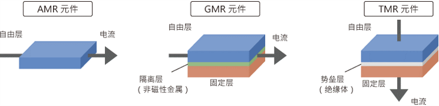

---
categories:
- 因果推断
date: '2022-01-19T12:59:00.000Z'
description: just a test
image: null
showToc: true
tags:
- 因果推断
title: ddd

---


[『Cmd 技术渲染的沙箱页面，点击此处编写自己的文档』](https://www.zybuluo.com/mdeditor)

<br/>

# Cmd Markdown 简明语法手册

标签： Cmd-Markdown

---

# 1. 斜体和粗体

使用 * 和 ** 表示斜体和粗体。

示例：$ \int_{x}^{y}{abcdx} $

- aaaa

- cccc

---

[http://www.baidu.com](http://www.baidu.com)


这是 *斜体*，这是 **粗体**。

[video is not supported]

## 2. 分级标题

使用 === 表示一级标题，使用 — 表示二级标题。

示例：

```plain text
	这是一个一级标题
============================

这是一个二级标题
--------------------------------------------------

### 这是一个三级标题
```

你也可以选择在行首加井号表示不同级别的标题 (H1-H6)，例如：# H1, ## H2, ### H3，#### H4。

### 3. 外链接

使用 [描述](链接地址) 为文字增加外链接。

示例：

这是去往 [本人博客](http://ghosertblog.github.com/) 的链接。

### 4. 无序列表

使用 *，+，- 表示无序列表。

示例：

- 无序列表项 一

- 无序列表项 二

- 无序列表项 三

### 5. 有序列表

使用数字和点表示有序列表。

示例：

1. 有序列表项 一

1. 有序列表项 二

1. 有序列表项 三

### 6. 文字引用

使用 > 表示文字引用。

示例：

> 野火烧不尽，春风吹又生。

### 7. 行内代码块

使用 `代码` 表示行内代码块。

示例：

让我们聊聊 `html`。

### 8. 代码块

使用 四个缩进空格 表示代码块。

示例：

```plain text
	这是一个代码块，此行左侧有四个不可见的空格。
```

### 9. 插入图像

使用  插入图像。

示例：

我的头像




### 5. LaTeX 公式

$ 表示行内公式：

质能守恒方程可以用一个很简洁的方程式 *E* = *m**c*2 来表达。

$$ 表示整行公式：

$$ 
\sum_{i=1}^n a_i=0 
$$

$$ f(x1, xx, …, xn) = x12 + x22 + ⋯ + xn2 $$

$$ \sum^{j-1}_{k=0}{\widehat{\gamma}_{kj} z_k} $$

访问 [MathJax](http://meta.math.stackexchange.com/questions/5020/mathjax-basic-tutorial-and-quick-reference) 参考更多使用方法。

### 6. 加强的代码块

支持四十一种编程语言的语法高亮的显示，行号显示。

非代码示例：

```plain text
	$ sudo apt-get install vim-gnome
```

Python 示例：

```plain text
	@requires_authorizationdef somefunc(param1='', param2=0):    '''A docstring'''    if param1 > param2: # interesting        print 'Greater'    return (param2 - param1 + 1) or Noneclass SomeClass:    pass>>> message = '''interpreter... prompt'''
```

JavaScript 示例：

```plain text
	/*** nth element in the fibonacci series.* @param n >= 0* @return the nth element, >= 0.*/function fib(n) {  var a = 1, b = 1;  var tmp;  while (--n >= 0) {    tmp = a;    a += b;    b = tmp;  }  return a;}document.write(fib(10));
```

### 12. 表格支持

 | table | **price** | *number* | 
 | ---- | ---- | ---- | 
 | computer | <u>1600</u> | ~~5~~ | 
 | moblie | $ \sum{x} $ | `12` | 
 | 管线 |  (2022-01-20 → )  | [234](http://www.bilibili.com) | 

### 16. 待办事宜 Todo 列表

使用带有 [ ] 或 [x] （未完成或已完成）项的列表语法撰写一个待办事宜列表，并且支持子列表嵌套以及混用Markdown语法，例如：

```plain text
	- [ ] **Cmd Markdown 开发**
    - [ ] 改进 Cmd 渲染算法，使用局部渲染技术提高渲染效率
    - [ ] 支持以 PDF 格式导出文稿
    - [x] 新增Todo列表功能 [语法参考](https://github.com/blog/1375-task-lists-in-gfm-issues-pulls-comments)
    - [x] 改进 LaTex 功能
        - [x] 修复 LaTex 公式渲染问题
        - [x] 新增 LaTex 公式编号功能 [语法参考](http://docs.mathjax.org/en/latest/tex.html#tex-eq-numbers)
- [ ] **七月旅行准备**
    - [ ] 准备邮轮上需要携带的物品
    - [ ] 浏览日本免税店的物品
    - [x] 购买蓝宝石公主号七月一日的船票
```

对应显示如下待办事宜 Todo 列表：

- [ ] **Cmd Markdown 开发**

	- [ ] 改进 Cmd 渲染算法，使用局部渲染技术提高渲染效率

	- [ ] 支持以 PDF 格式导出文稿

	- [x] 新增Todo列表功能 [语法参考](https://github.com/blog/1375-task-lists-in-gfm-issues-pulls-comments)

	- [x] 改进 LaTex 功能

		- [x] 修复 LaTex 公式渲染问题

		- [x] 新增 LaTex 公式编号功能 [语法参考](http://docs.mathjax.org/en/latest/tex.html#tex-eq-numbers)

- [ ] **七月旅行准备**

	- [ ] 准备邮轮上需要携带的物品

	- [ ] 浏览日本免税店的物品

	- [x] 购买蓝宝石公主号七月一日的

